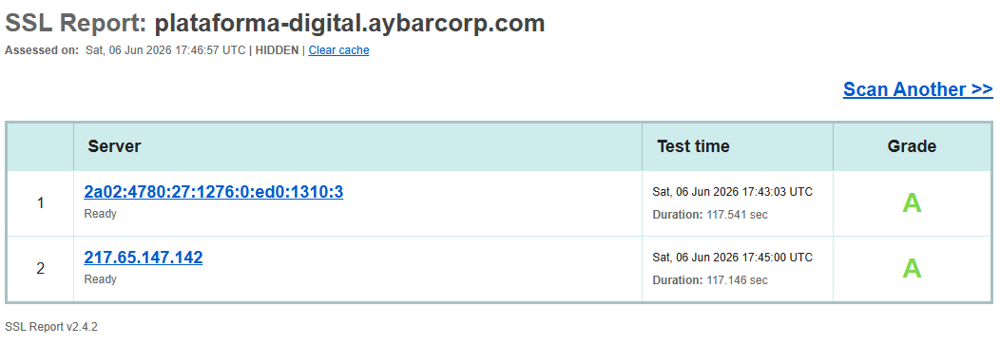

# Verificación SSL — plataforma-digital.aybarcorp.com

**Fecha:** 06 de junio de 2026
**Verificado por:** Matias Lázaro

## Resultados

- **SSL Labs Rating:** [A / A+ / B / etc.]
- **Emisor del certificado:** [Let's Encrypt / Sectigo / etc.]
- **Vigencia:** [Hasta DD-MM-YYYY]
- **Protocolos soportados:** [TLS 1.2, TLS 1.3]
- **HSTS habilitado:** [Sí/No]

## Captura de pantalla

SSL Report: plataforma-digital.aybarcorp.com
Assessed on:  Sat, 06 Jun 2026 17:46:57 UTC

Server	Test time	Grade
1	2a02:4780:27:1276:0:ed0:1310:3  Sat, 06 Jun 2026 17:43:03 UTC   Duration: 117.541 sec	A
2	217.65.147.142                  Sat, 06 Jun 2026 17:45:00 UTC   Duration: 117.146 sec	A

## Conclusión
❌ El dominio cumple los requisitos para configurar OAuth 2.0 con Google Cloud
   y para futuro webhook con Pub/Sub.
