# Reportes ERP de Aybar para Power BI

Este documento resume los dashboards que viven bajo `/erp/reporte`, qué tablas usa cada uno, qué cruces hace la lógica actual de Laravel y cómo replicarlo en Power BI con un modelo entendible y mantenible.

## 1) Dashboards disponibles

Las vistas reales son estas:

- `/erp/reporte/cliente`
- `/erp/reporte/admin`
- `/erp/reporte/direccion`
- `/erp/reporte/solicitud-evidencia-pago`
- `/erp/reporte/evidencia-pago`
- `/erp/reporte/evidencia-pago-antiguo`
- `/erp/reporte/ticket`
- `/erp/reporte/cita`
- `/erp/reporte/letra`

## 2) Mapa de datos por dashboard

### A. Reporte de clientes

Fuente principal:

- `clientes`

Cruces:

- `clientes.user_id -> users.id`
- `users.id -> direccions.user_id`
- `direccions.region_id -> regions.id`
- `direccions.provincia_id -> provincias.id`
- `direccions.distrito_id -> distritos.id`

Qué muestra:

- Total de clientes
- Clientes activos/inactivos
- Crecimiento mensual
- Clientes con foto
- Clientes con contraseña cambiada
- Tendencia por mes y por día
- Verificación de email
- Clientes con/sin dirección
- Perfil de completitud
- Distribución por región
- Dominios de correo

### B. Reporte de administradores

Fuente principal:

- `users` filtrando `rol = admin`

Cruces:

- `model_has_roles.model_id -> users.id`
- `model_has_roles.role_id -> roles.id`

Qué muestra:

- Total de admins
- Activos/inactivos
- Nuevos del mes
- Distribución de roles
- Tendencia diaria de creación

### C. Reporte de direcciones

Fuente principal:

- `direccions`

Cruces:

- `direccions.user_id -> users.id` con `users.rol = cliente`
- `direccions.region_id -> regions.id`
- `direccions.provincia_id -> provincias.id`
- `direccions.distrito_id -> distritos.id`

Qué muestra:

- Total de direcciones
- Regiones cubiertas
- Distritos cubiertos
- Nuevas direcciones del mes
- Distribución geográfica
- Tendencia diaria del mes
- Últimas direcciones registradas

### D. Reporte solicitud de evidencia de pago

Fuente principal:

- `solicitud_evidencia_pagos`

Cruces:

- `unidad_negocio_id -> unidad_negocios.id`
- `proyecto_id -> proyectos.id`
- `estado_solicitud_evidencia_pago_id -> estado_solicitud_evidencia_pagos.id`
- `cliente_id -> users.id`
- `gestor_id -> users.id`
- `usuario_valida_id -> users.id`
- `solicitud_evidencia_pagos.id -> evidencia_pagos.solicitud_evidencia_pago_id`
- `solicitud_evidencia_pago_emails.solicitud_evidencia_pago_id -> solicitud_evidencia_pagos.id`

Qué muestra:

- Total de solicitudes
- Sin asignar / asignadas
- Validadas / pendientes
- Tasa de cumplimiento
- Total de emails enviados
- Total de archivos de evidencia
- Evidencias antiguas
- Solicitudes por estado, unidad, proyecto
- Ranking de gestores
- Solicitudes por cantidad de evidencias
- Distribución de bancos
- Evidencias por estado
- Antigüedad de evidencias
- Actividad por día y por hora

### E. Reporte evidencia de pago

Fuente principal:

- `evidencia_pagos`

Cruces:

- `evidencia_pagos.solicitud_evidencia_pago_id -> solicitud_evidencia_pagos.id`
- `evidencia_pagos.estado_solicitud_evidencia_pago_id -> estado_solicitud_evidencia_pagos.id`

Qué muestra:

- Total de archivos
- Cierre manual vs SLIN
- Monto total procesado
- Tasa de automatización
- Distribución por banco
- Distribución por extensión
- Distribución por estado
- Evolución de montos por día
- Últimas evidencias

### F. Reporte evidencia de pago antiguo

Fuente actual:

- La clase no trae consultas.
- Solo retorna la vista.

Sugerencia:

- Revisar si la vista consume `evidencia_pago_antiguos` o si quedó como pantalla heredada.

### G. Reporte de tickets

Fuente principal:

- `tickets`

Cruces:

- `estado_ticket_id -> estado_tickets.id`
- `area_id -> areas.id`
- `canal_id -> canals.id`
- `tipo_solicitud_id -> tipo_solicituds.id`
- `sub_tipo_solicitud_id -> sub_tipo_solicituds.id`
- `prioridad_ticket_id -> prioridad_tickets.id`
- `cliente_id -> users.id`
- `gestor_id -> users.id`
- `ticket_derivados.ticket_id -> tickets.id`

Qué muestra:

- Total de tickets
- Cerrados / abiertos
- Vencidos
- Tiempo promedio de cierre
- Tickets por estado, área, canal y tipo
- Creados vs cerrados por día
- Ranking de gestores
- Últimos tickets
- Últimas derivaciones

### H. Reporte de citas

Fuente principal:

- `citas`

Cruces:

- `estado_cita_id -> estado_citas.id`
- `sede_id -> sedes.id`
- `motivo_cita_id -> motivo_citas.id`
- `cliente_id -> users.id`
- `gestor_id -> users.id`
- `area_id -> areas.id`

Qué muestra:

- Total de citas
- Atendidas / pendientes / canceladas
- Tasa de cumplimiento
- Por estado, sede y motivo
- Tendencia diaria
- Ranking de gestores
- Últimas citas

### I. Reporte de letras

Fuente principal:

- `solicitud_digitalizar_letras`

Cruces:

- `estado_solicitud_digitalizar_letra_id -> estado_solicitud_digitalizar_letras.id`
- `unidad_negocio_id -> unidad_negocios.id`
- `proyecto_id -> proyectos.id`
- `cliente_id -> users.id`
- `gestor_id -> users.id`

Qué muestra:

- Total de solicitudes
- Importe total
- Aprobadas / pendientes
- Tasa de aprobación
- Por estado, unidad, proyecto
- Tendencia diaria
- Últimas solicitudes

## 3) Modelo recomendado para Power BI

Para Power BI te conviene usar un esquema estrella, no tratar de replicar la lógica Laravel tabla por tabla.

### Tablas de hechos sugeridas

- `FactClientes`
- `FactDirecciones`
- `FactAdmins`
- `FactSolicitudEvidenciaPago`
- `FactEvidenciaPago`
- `FactTickets`
- `FactCitas`
- `FactSolicitudDigitalizarLetra`

### Dimensiones sugeridas

- `DimFecha`
- `DimUsuario`
- `DimRegion`
- `DimProvincia`
- `DimDistrito`
- `DimUnidadNegocio`
- `DimProyecto`
- `DimEstadoSolicitudEvidenciaPago`
- `DimEstadoTicket`
- `DimEstadoCita`
- `DimEstadoSolicitudLetra`
- `DimArea`
- `DimCanal`
- `DimTipoSolicitud`
- `DimPrioridad`
- `DimSede`
- `DimMotivoCita`
- `DimBanco`

### Recomendación práctica

- No mezcles todo en una sola tabla gigante.
- Conserva una tabla de hechos por proceso de negocio.
- Usa `DimFecha` para todas las tendencias mensuales y diarias.
- Usa `DimUsuario` para clientes, gestores, validadores y emisores si necesitas trazabilidad.

## 4) Diagrama lógico sugerido

```mermaid
erDiagram
    FACT_SOLICITUD_EVIDENCIA_PAGO }o--|| DIM_UNIDAD_NEGOCIO : unidad_negocio_id
    FACT_SOLICITUD_EVIDENCIA_PAGO }o--|| DIM_PROYECTO : proyecto_id
    FACT_SOLICITUD_EVIDENCIA_PAGO }o--|| DIM_ESTADO_SOLICITUD_EVIDENCIA_PAGO : estado_id
    FACT_SOLICITUD_EVIDENCIA_PAGO }o--|| DIM_USUARIO : cliente_id
    FACT_SOLICITUD_EVIDENCIA_PAGO }o--|| DIM_USUARIO : gestor_id

    FACT_EVIDENCIA_PAGO }o--|| FACT_SOLICITUD_EVIDENCIA_PAGO : solicitud_id
    FACT_EVIDENCIA_PAGO }o--|| DIM_ESTADO_SOLICITUD_EVIDENCIA_PAGO : estado_id
    FACT_EVIDENCIA_PAGO }o--|| DIM_FECHA : fecha_id

    FACT_TICKETS }o--|| DIM_AREA : area_id
    FACT_TICKETS }o--|| DIM_CANAL : canal_id
    FACT_TICKETS }o--|| DIM_TIPO_SOLICITUD : tipo_solicitud_id
    FACT_TICKETS }o--|| DIM_PRIORIDAD : prioridad_id
    FACT_TICKETS }o--|| DIM_ESTADO_TICKET : estado_id
    FACT_TICKETS }o--|| DIM_USUARIO : gestor_id

    FACT_CITAS }o--|| DIM_SEDE : sede_id
    FACT_CITAS }o--|| DIM_MOTIVO_CITA : motivo_id
    FACT_CITAS }o--|| DIM_ESTADO_CITA : estado_id
    FACT_CITAS }o--|| DIM_USUARIO : gestor_id

    FACT_SOLICITUD_LETRA }o--|| DIM_UNIDAD_NEGOCIO : unidad_negocio_id
    FACT_SOLICITUD_LETRA }o--|| DIM_PROYECTO : proyecto_id
    FACT_SOLICITUD_LETRA }o--|| DIM_ESTADO_SOLICITUD_LETRA : estado_id
    FACT_SOLICITUD_LETRA }o--|| DIM_USUARIO : gestor_id
```

## 5) Paso a paso para construirlo en Power BI

### Paso 1. Conectar a MySQL

1. Abre Power BI Desktop.
2. Ve a `Obtener datos`.
3. Selecciona `MySQL database`.
4. Coloca servidor, base de datos y credenciales.
5. Elige `Import` para análisis rápido y estable.

### Paso 2. Cargar solo las tablas necesarias

Carga, como mínimo, estas tablas:

- `vw_pbi_dim_fecha`
- `vw_pbi_dim_usuario`
- `vw_pbi_dim_region`
- `vw_pbi_dim_provincia`
- `vw_pbi_dim_distrito`
- `vw_pbi_dim_unidad_negocio`
- `vw_pbi_dim_proyecto`
- `users`
- `clientes`
- `direccions`
- `regions`
- `provincias`
- `distritos`
- `solicitud_evidencia_pagos`
- `solicitud_evidencia_pago_emails`
- `evidencia_pagos`
- `estado_solicitud_evidencia_pagos`
- `tickets`
- `ticket_derivados`
- `estado_tickets`
- `areas`
- `canals`
- `tipo_solicituds`
- `prioridad_tickets`
- `citas`
- `estado_citas`
- `sedes`
- `motivo_citas`
- `solicitud_digitalizar_letras`
- `estado_solicitud_digitalizar_letras`
- `unidad_negocios`
- `proyectos`
- `roles` y `model_has_roles` si vas a replicar el reporte de admins

### Paso 3. Limpiar datos en Power Query

1. Verifica tipos de dato.
2. Convierte fechas a `Date` o `DateTime`.
3. Convierte importes a `Decimal Number`.
4. Renombra columnas para que sean legibles.
5. Elimina columnas que no usarás en el modelo analítico.

### Paso 4. Crear dimensiones

1. Duplica o referencia las tablas maestras.
2. Deja una tabla por dimensión.
3. Quita duplicados por clave primaria.
4. Conserva solo atributos descriptivos.

### Paso 5. Crear tabla de fechas

Necesitas una `DimFecha` única para todo el modelo.

Ejemplo de columna útil:

- Fecha
- Año
- Mes
- Nombre del mes
- Trimestre
- Semana
- Día del mes
- Año-Mes

### Paso 6. Definir relaciones

1. Ve a la vista de modelo.
2. Relaciona cada hecho con sus dimensiones.
3. Usa cardinalidad `Muchos a uno`.
4. Mantén filtro de dirección simple desde dimensión hacia hecho.
5. Evita relaciones ambiguas; si un hecho tiene varios roles de usuario, usa dimensiones separadas o una `DimUsuario` con rol funcional.

### Paso 7. Medidas DAX básicas

Te conviene crear medidas como estas:

- Total Registros
- Total Clientes
- Total Tickets
- Total Citas
- Total Solicitudes
- Total Evidencias
- % Cumplimiento
- % Automatización
- Monto Total
- Promedio de Cierre
- Cerrados
- Abiertos
- Pendientes

### Paso 8. Construir páginas del dashboard

Una forma ordenada es una página por dominio:

- Página 1: Resumen general
- Página 2: Clientes y direcciones
- Página 3: Backoffice evidencia de pago
- Página 4: Tickets ATC
- Página 5: Citas
- Página 6: Letras

### Paso 9. Replicar visuales equivalentes

Usa estos visuales:

- Tarjetas para KPIs
- Column chart para tendencias por día o mes
- Donut/Pie para estados y distribuciones
- Bar chart para top gestores, sedes, regiones, bancos
- Matrix para tablas recientes
- Slicers para mes, año, estado, unidad, proyecto, gestor

### Paso 10. Validar contra Laravel

Compara el total de cada métrica en Power BI con lo que calcula Laravel para confirmar que el modelo está alineado.

## 6) Orden recomendado de construcción

Si quieres avanzar sin perderte, hazlo en este orden:

1. Primero: `clientes`, `users`, `direccions`, `regions`, `provincias`, `distritos`.
2. Después: `solicitud_evidencia_pagos`, `evidencia_pagos`, `solicitud_evidencia_pago_emails`.
3. Luego: `tickets` y sus catálogos.
4. Luego: `citas` y sus catálogos.
5. Finalmente: `solicitud_digitalizar_letras` y catálogos.

## 7) Recomendación de modelado

Si tu objetivo es que quede sólido para dirección y análisis operativo, no copies la UI tal cual. Copia la lógica de negocio:

- Una página por dominio.
- Una tabla de hechos por proceso.
- Catálogos como dimensiones.
- `DimFecha` compartida.
- Medidas DAX en lugar de columnas calculadas cuando sea posible.

## 8) Siguiente paso útil

Si quieres, puedo prepararte el siguiente entregable:

1. Un diagrama ER en Mermaid más limpio y separado por módulo.
2. Un archivo con las medidas DAX exactas para Power BI.
3. Un set de consultas SQL listas para pegar en Power BI y traer cada dashboard.

## 9) Consultas SQL listas

Ya te dejé el script en [docs/PowerBI/POWERBI_QUERIES.sql](docs/PowerBI/POWERBI_QUERIES.sql).

### Como usarlo

1. Abre tu gestor SQL preferido, por ejemplo MySQL Workbench o phpMyAdmin.
2. Conecta a la misma base de datos de Laravel.
3. Ejecuta el archivo completo `POWERBI_QUERIES.sql`.
4. Eso crea vistas `vw_pbi_*` para cada dominio analitico.
5. En Power BI Desktop ve a `Obtener datos` y elige `MySQL database`.
6. Carga las vistas que necesites, por ejemplo `vw_pbi_fact_tickets` o `vw_pbi_fact_solicitud_evidencia_pago`.
7. Crea relaciones entre las vistas de hechos y las vistas de dimensiones.
8. Crea tus medidas DAX encima de esas vistas.

### Orden recomendado de carga

1. Primero las dimensiones: `vw_pbi_dim_usuario`, `vw_pbi_dim_region`, `vw_pbi_dim_provincia`, `vw_pbi_dim_distrito`, `vw_pbi_dim_unidad_negocio`, `vw_pbi_dim_proyecto`.
2. Carga también `vw_pbi_dim_fecha` como calendario central.
3. Luego las tablas de proceso: `vw_pbi_fact_clientes`, `vw_pbi_fact_direcciones`, `vw_pbi_fact_admins`.
4. Después backoffice: `vw_pbi_fact_solicitud_evidencia_pago`, `vw_pbi_fact_solicitud_evidencia_pago_emails`, `vw_pbi_fact_evidencia_pago`.
5. Finalmente operativos: `vw_pbi_fact_tickets`, `vw_pbi_fact_ticket_derivados`, `vw_pbi_fact_citas`, `vw_pbi_fact_solicitud_digitalizar_letra`.

### Nota importante

Las vistas son la forma mas limpia de consumir el modelo desde Power BI porque separan la extraccion de datos de la capa visual. Si luego cambian nombres de tablas o relaciones en Laravel, solo ajustas este script y no el reporte entero.